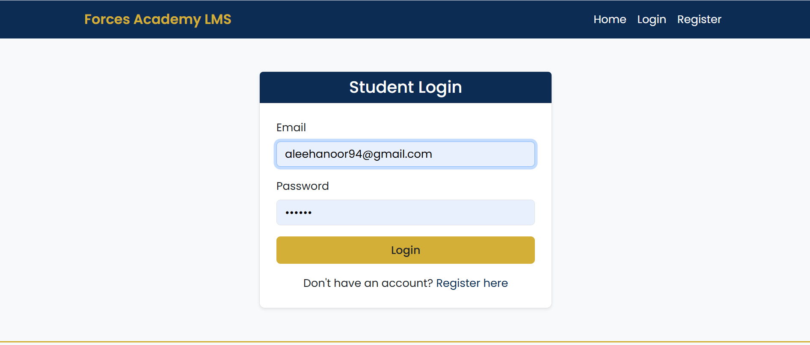
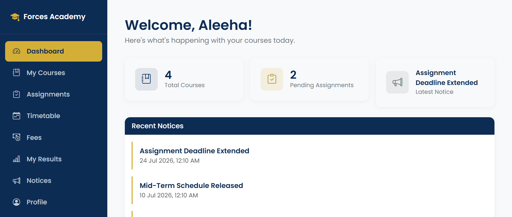
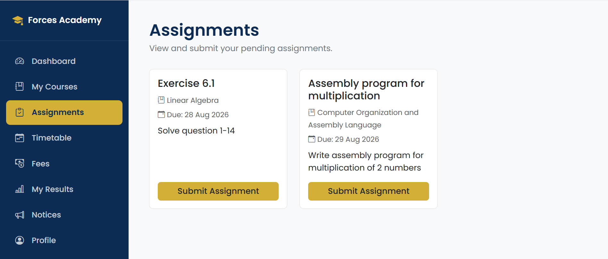
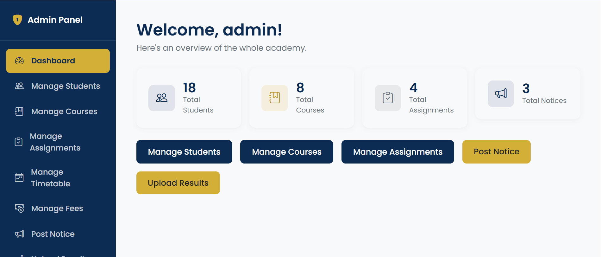
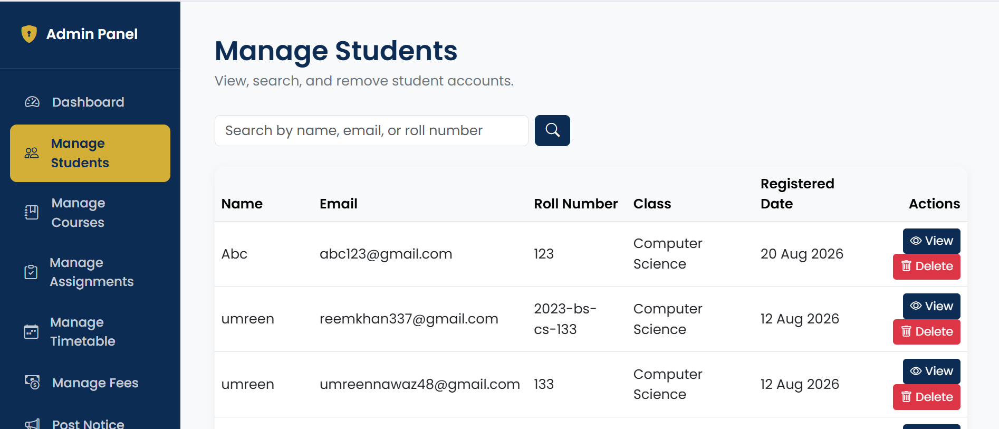
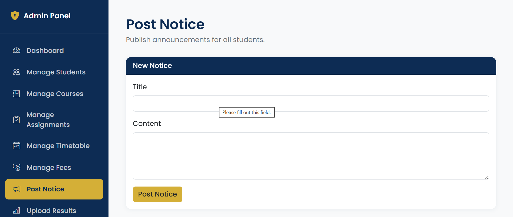

Forces Academy - [Full stack]|Code Saviours SI-26|[Aleeha]
# Forces Academy — Student LMS Portal

A full-stack Learning Management System built for Forces Academy , with separate student and admin portals for managing courses, assignments, fees, results, timetables, and notices.

🔗 **Live site:** [https://forces-academy-lms.infinityfree.io/]
📦 **Tech stack:** PHP · MySQL · Bootstrap 5 · Bootstrap Icons

---

## Screenshots

| Login | Student Dashboard | Assignments |
|---|---|---|
|  |  |  |

| Admin Dashboard | Manage Students | Notices |
|---|---|---|
|  |  |  |


---

## Tech Stack

- **Backend:** PHP (procedural, mysqli with prepared statements)
- **Database:** MySQL
- **Frontend:** Bootstrap 5, Bootstrap Icons, custom CSS
- **Hosting:** InfinityFree (live), XAMPP (local development)
- **Version control:** Git & GitHub

## Features

**Student Portal**
- Secure registration and login (session-based auth)
- Dashboard with an overview of courses, notices, and upcoming items
- View enrolled courses
- View and submit assignments (file upload)
- View personal timetable
- View fee status
- View results
- Notice board
- Editable profile page
- Fully responsive — works on mobile, tablet, and desktop

**Admin Portal**
- Separate admin authentication, isolated from student sessions
- Manage students (add/edit/view student details)
- Manage courses
- Manage and grade assignments
- Manage timetable
- Manage fees
- Post notices
- Upload/manage results

## How to Run Locally

1. **Clone the repo**
```bash
   git clone <your-repo-url>
   cd forces-academy-lms
```

2. **Set up the database**
   - Create a MySQL database (e.g. via phpMyAdmin in XAMPP)
   - Import the provided schema/SQL file into it *(add your `.sql` export to the repo and reference it here)*

3. **Configure the database connection**
   - Copy `config/db.sample.php` to `config/db.php`
   - Fill in your local database host, username, password, and database name
   - `config/db.php` is gitignored on purpose — it holds real credentials and should never be committed

4. **Run with XAMPP**
   - Place the project folder inside `htdocs`
   - Start Apache and MySQL from the XAMPP control panel
   - Visit `http://localhost/forces-academy-lms/` in your browser

5. **Login**
   - Register a new student account from the Register page, or
   - Use the admin login at `/admin/login.php` with an admin account created via `admin/create_admin.php`

## Project Structure
forces-academy-lms/
├── admin/ # Admin portal (dashboard, students, courses, fees, etc.)
├── config/ # Database configuration (db.sample.php as template)
├── css/ # Stylesheet
├── includes/ # Shared components (sidebar, auth check)
├── js/ # JavaScript
├── uploads/ # Student-submitted assignment files
├── *.php # Student-facing pages (dashboard, courses, assignments, etc.)
└── README.md


---

Built by Aleeha | Code Saviours SI-26 | 2026


